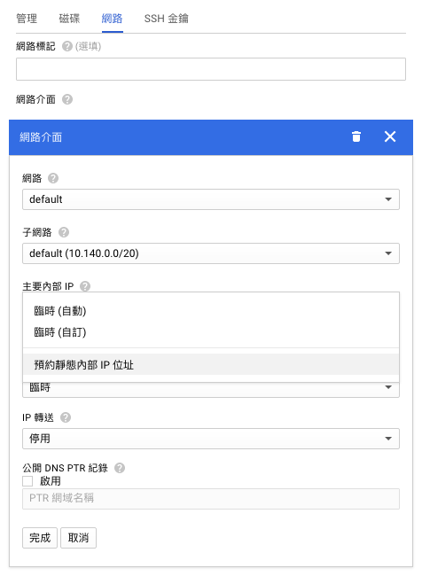
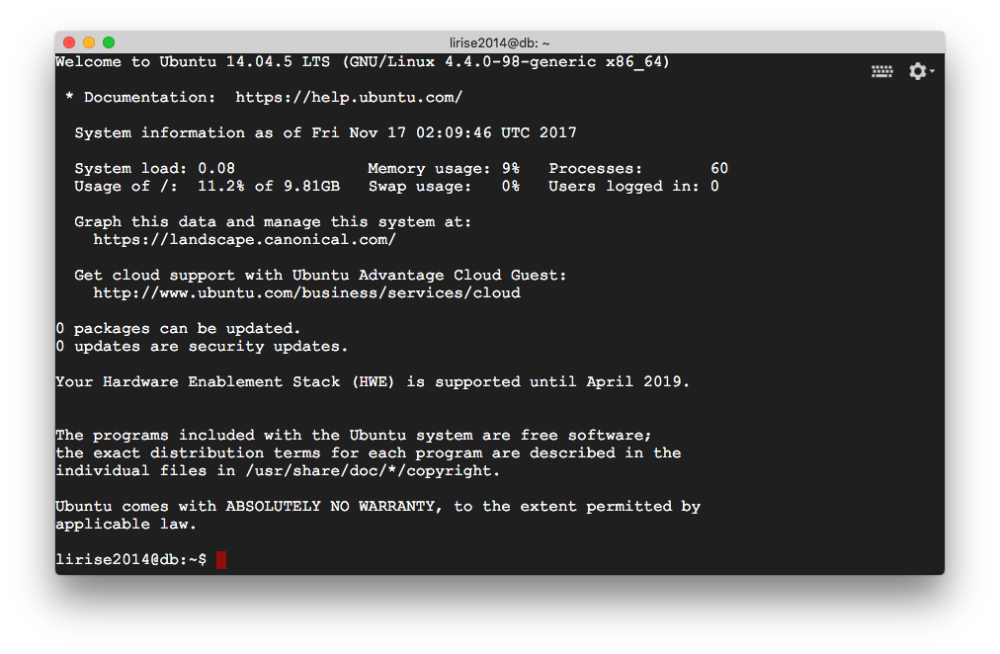

# 建立 Parse 資料庫服務

## 目錄

* [概述說明](jian-li-parse-zi-liao-ku-fu-wu.md#intro)
* [建立虛擬機](jian-li-parse-zi-liao-ku-fu-wu.md#db-vm)
* [建立資料庫服務](jian-li-parse-zi-liao-ku-fu-wu.md#db-service)
* [啟用資料庫身份驗證](jian-li-parse-zi-liao-ku-fu-wu.md#db-service-enable-auth)
* [建立並設定 Parse 資料庫](jian-li-parse-zi-liao-ku-fu-wu.md#db-instance)
* [其他設定](jian-li-parse-zi-liao-ku-fu-wu.md#other)
* [補充說明](jian-li-parse-zi-liao-ku-fu-wu.md#supply)

## 概述說明 <a id="intro"></a>

Parse Service 在常見的配置上，包含**「資料庫服務」**用以存放資料，**「Parse 伺服器」**作為服務端口，**「Parse Dashboard」**提供簡單的管理之用。在這次的範例中，將會演示建立以 [Google Cloud Platform（下稱 GCP）](https://cloud.google.com/)的 Compute Engine「虛擬機」為基礎的方式，逐步架設 Parse 所需的**「資料庫服務」**

> IaaS 可依需求、價格選用合適的服務提供商，如：[AWS](https://aws.amazon.com/), [Linode](https://www.linode.com/)
>
> **大部分的 IaaS 服務商，通常都有提供免費試用計畫**，比如：[GCP 免費項目](https://cloud.google.com/free/), [AWS 免費方案](https://aws.amazon.com/tw/free/)

## 建立虛擬機 <a id="db-vm"></a>

* 在 [GCP 的 Compute Engine](https://console.cloud.google.com/compute) 控制介面中，點擊「建立」，新增 VM Instance


* 設定 Instance 相關資訊
  * 名稱：自行命名
  * 區域：可參考 Google 提供的[服務地點說明](https://cloud.google.com/about/locations/)來決定，亞太地區 Cloud Compute 可選擇：新加坡\(asia-southeast1\)    、台灣\(asia-east1\)、東京\(asia-northeast1\)、雪梨\(australia-southeast1\)
  * 機器類型：依需求決定，範例選用微型機器
  * 開機磁碟：依需求決定，範例使用預設磁碟大小
  * 作業系統：範例選用 Ubuntu 14.04 LTS


* 點開「管理、磁碟、網路、SSH 金鑰」，切換到「網路」頁籤，在「主要內部 IP」的選項中，點擊「預約靜態內部 IP 位址」，填入名稱進行預約，讓此主機在未來即使重新啟動，都能綁定至此內部 IP



* 等待建立完成後，便完成了一台虛擬機的啟用。爾後可以在此畫面，管理所有建立的虛擬機。也可透過後方的按鈕，直接透過 SSH 登入到每一台虛擬機


## 建立資料庫服務 <a id="db-service"></a>

目前 Parse Server [支援 MongoDB 2.6.X, 3.0.X or 3.2.X](http://docs.parseplatform.org/parse-server/guide/#prerequisites)，這次演示選用 3.2 版來安裝。MongoDB 針對 LTS 版本的 Ubuntu 有長期的支援，如: 12.04 LTS \(precise\), 14.04 LTS \(trusty\), 16.04 LTS \(xenial\)。接下來透過以下命令在 SSH 安裝 MongoDB

* 登入資料庫虛擬機



* 匯入 MongoDB GPG 公開金鑰

  ```text
  sudo apt-key adv --keyserver hkp://keyserver.ubuntu.com:80 --recv EA312927
  ```

* 建立 MongoDB 檔案清單

  ```text
  echo "deb http://repo.mongodb.org/apt/ubuntu trusty/mongodb-org/3.2 multiverse" | sudo tee /etc/apt/sources.list.d/mongodb-org-3.2.list
  ```

* 更新本地端套件資料庫

  ```text
  sudo apt-get update
  ```

* 安裝 MongoDB 套件

  > 範例使用 3.2.17 版

  ```text
  sudo apt-get install -y mongodb-org=3.2.17 mongodb-org-server=3.2.17 mongodb-org-shell=3.2.17 mongodb-org-mongos=3.2.17 mongodb-org-tools=3.2.17
  ```

* 將 MongoDB 鎖定目前版本

  ```text
  echo "mongodb-org hold" | sudo dpkg --set-selections
  echo "mongodb-org-server hold" | sudo dpkg --set-selections
  echo "mongodb-org-shell hold" | sudo dpkg --set-selections
  echo "mongodb-org-mongos hold" | sudo dpkg --set-selections
  echo "mongodb-org-tools hold" | sudo dpkg --set-selections
  ```

* 至此，基本的 MongoDB 服務已經開始運作

## 啟用資料庫身份驗證 <a id="db-service-enable-auth"></a>

剛建立起來的 MongoDB 服務，處於開放狀態，接下來將會演示，如何建立「管理者」並啟用「資料庫身份驗證」功能，來達到最基本的安全性

* 登入本地端資料庫（登入後將會轉換成資料庫命令列）

  ```text
  mongo 127.0.0.1
  ```

* 切換至 admin 資料庫

  ```text
  use admin
  ```

* 新增最高管理員帳號。如果想知道更多關於預設的資料庫角色，可[到此觀看](https://docs.mongodb.com/manual/reference/built-in-roles/)

  > 請記得將範例中的 ADMIN\_USER, ADMIN\_PASSWORD 替換成您的設定值

  ```text
  db.createUser(
    {
      user: "ADMIN_USER",
      pwd: "ADMIN_PASSWORD",
      roles: [ { role: "userAdminAnyDatabase", db: "admin" } ]
    }
  )
  ```

* 將資料庫授權於此帳號

  > 請記得將範例中的 ADMIN\_USER, ADMIN\_PASSWORD 替換成您的設定值

  ```text
  db.auth("ADMIN_USER", "ADMIN_PASSWORD")
  ```

* 離開資料庫連線，回到主機 SSH

  ```text
  exit
  ```

* 編輯 MongoDB 設定檔案，在檔案中加入啟用身份驗證的設定。以下腳本將直接寫入一個 Parse 可用的基本設定檔

  > 關於更多的資料庫設定檔說明，可[參考此文件](https://docs.mongodb.com/v3.2/reference/configuration-options/)

  ```text
  echo "storage:" | sudo tee /etc/mongod.conf
  echo "  dbPath: /var/lib/mongodb" | sudo tee -a /etc/mongod.conf
  echo "  journal:" | sudo tee -a /etc/mongod.conf
  echo "    enabled: true" | sudo tee -a /etc/mongod.conf

  echo "systemLog:" | sudo tee -a /etc/mongod.conf
  echo "  destination: file" | sudo tee -a /etc/mongod.conf
  echo "  logAppend: true" | sudo tee -a /etc/mongod.conf
  echo "  path: /var/log/mongodb/mongod.log" | sudo tee -a /etc/mongod.conf

  echo "net:" | sudo tee -a /etc/mongod.conf
  echo "  port: 27017" | sudo tee -a /etc/mongod.conf
  echo "  bindIp: 0.0.0.0" | sudo tee -a /etc/mongod.conf

  echo "security:" | sudo tee -a /etc/mongod.conf
  echo "  authorization: enabled" | sudo tee -a /etc/mongod.conf

  echo "setParameter:" | sudo tee -a /etc/mongod.conf
  echo "  failIndexKeyTooLong: false" | sudo tee -a /etc/mongod.conf
  ```

* 重新啟動資料庫服務

  ```text
  sudo service mongod restart
  ```

* 至此，資料庫服務擁有了最基本的安全性。對於正式上線產品的安全性通常會有更高的要求，將會在後面介紹

## 建立並設定 Parse 資料庫 <a id="db-instance"></a>

接下來將會在資料庫服務中，建立一個資料庫作為 Parse 服務使用，並創建一個使用者 用來存取此資料庫。

* 以建立的管理者登入資料庫服務（登入後將會轉換成資料庫命令列）

  > 請記得將範例中的 ADMIN\_USER, ADMIN\_PASSWORD 替換成您的設定值

  ```text
  mongo 127.0.0.1 -u "ADMIN_USER" -p "ADMIN_PASSWORD" --authenticationDatabase "admin"
  ```

* 移動到欲使用的 Parse 資料庫，範例命名為 PARSE\_DB

  > PARSE\_DB 可替換任意資料庫名稱

  ```text
  use PARSE_DB
  ```

* 新增此資料庫使用的帳號

  > 請記得將範例中的 PARSE\_DB, PARSE\_DB\_USER, PARSE\_DB\_PASSWORD 替換成您的設定值

  ```text
  db.createUser(
    {
      user: "PARSE_DB_USER",
      pwd: "PARSE_DB_PASSWORD",
      roles: [ { role: "readWrite", db: "PARSE_DB" } ]
    }
  )
  ```

* 將資料庫授權於此帳號

  > 請記得將範例中的 PARSE\_DB\_USER, PARSE\_DB\_PASSWORD 替換成您的設定值

  ```text
  db.auth("PARSE_DB_USER", "PARSE_DB_PASSWORD")
  ```

* 離開資料庫連線，回到主機 SSH

  ```text
  exit
  ```

* 至此，Parse 所需使用的資料庫、使用者完成了基本的設定

## 其他設定（選用） <a id="other"></a>

MongoDB 建議在虛擬機上關閉 transparent\_hugepage 來提高機器效能，可在 init.d 中建立 script 讓每次虛擬機啟動時便關閉此功能

* 切換目錄

  ```text
  cd /etc/init.d
  ```

* 下載腳本

  ```text
  sudo wget https://gist.githubusercontent.com/kmshiori/6fa7893590603ec456817d130077351f/raw/083260422f411a866ce28ba58ec812b675ea14a0/disable-transparent-hugepages
  ```

* 授權腳本執行權限

  ```text
  sudo chmod 755 disable-transparent-hugepages
  ```

* 讓此腳本設定為啟動時運行

  ```text
  sudo update-rc.d disable-transparent-hugepages defaults
  ```

## 補充說明 <a id="supply"></a>

* 在 Google Compute Engine 啟用的虛擬機，預設網路設定僅會開啟 ICMP, RDP, SSH 等基本的協定所需之端口，若需要 MongoDB\(port 27017\) 能夠公開透過外部連線，則需要特別新增防火牆設定


* MongoDB 在安全性上除了提供帳號授權功能外，也提供 TLS/SSL 模式，更能提連線的資料安全性

