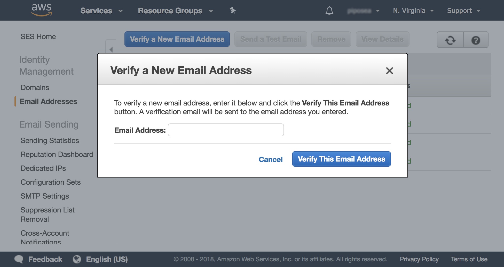
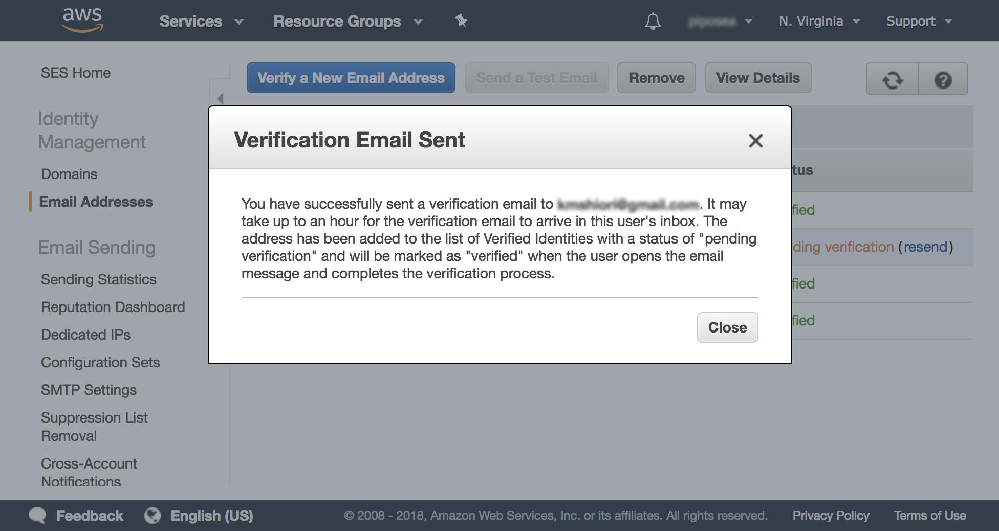
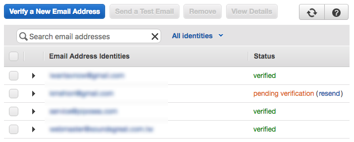
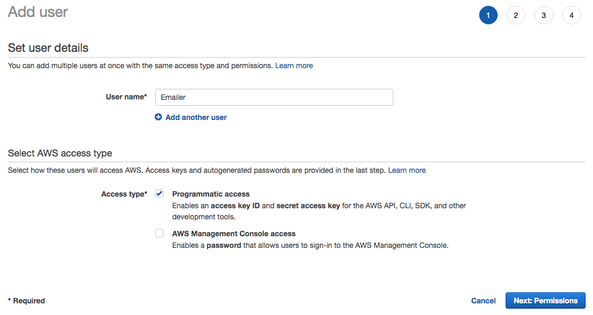
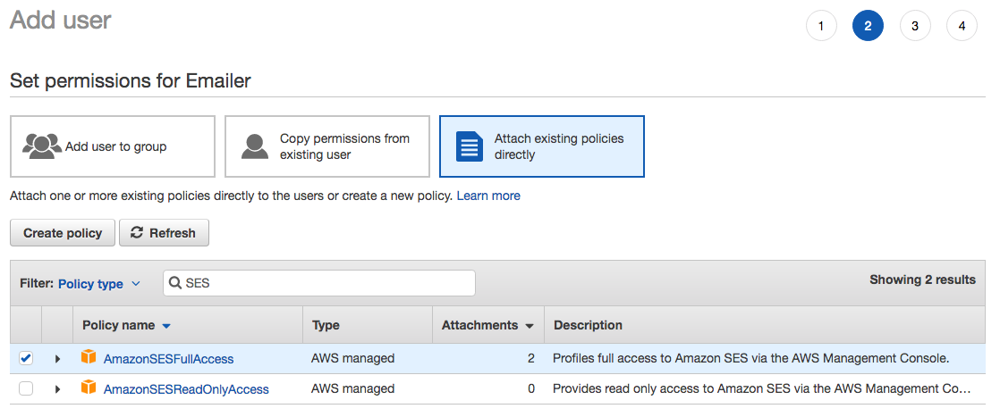
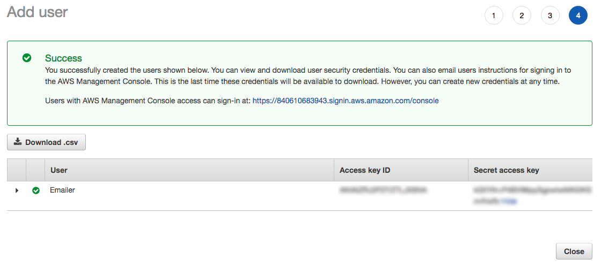

# Email 服務

> Email 在小產品中是常見的 Account System 驗證方式，在 Parse Service 以及 Firebase Authentication 中都能夠整合這樣的驗證方式；除此之外，Email 也常設計為輔助的通知系統

在 Parse 服務平台中，您必須使用外部的 Email 服務，並設定到 Parse 服務上，才能用來作為 User 認證系統使用；目前官方維護的 adapter 有 Mailgun 服務，其他非官方套件可支援 Amazon SES 服務, Mandrill 服務, Postmark 服務, Sendgrid 服務, Sendinblue 服務, Mailjet 服務, Generic 連線, Sendmail 連線, SMTP 連線...等等

在 Firebase 平台中，雖然 Authentication 由官方提供了 Email 驗證服務，但如果想寄送客製化內容的郵件，還是必須透過外部的服務商提供

## 目錄

* [常見 Email 服務商](email-fu-wu.md#service-provider)
* [申請 Amazon SES 服務](email-fu-wu.md#ses)
* [設定 Parse Mail 服務](email-fu-wu.md#adapter)
* [在 Parse Cloud Code 中使用 Amazon SES 服務寄送 Email](email-fu-wu.md#cloudcode)

## 常見 Email 服務商 <a id="service-provider"></a>

> 注意：製表日期 2018 Mar，服務商可能隨時調整服務內容

常見的 Mail 服務商中，有部分提供了定期免費額度，可供小型產品試用，以下提供參考

|  | Free |
| :--- | :--- |
| Mailgun | 10k / month   須完成 domain 綁定 |
| Amazon SES | 62k / month   須從 EC2 中託管的應用程式傳送 |
| SendGrid | 40,000 前 30 日   之後 100 / day   需綁定信用卡選擇試用後消費計畫 |
| SendinBlue | 600 / day |

以下提供價格計算機，以及不同量級的服務價格（美金），僅供參考

* [Mailgun 價格計算機](https://www.mailgun.com/pricing-2)
* [Amazon SES 價格介紹](https://aws.amazon.com/tw/ses/pricing/)，[價格計算機](https://calculator.s3.amazonaws.com/index.html)
* [Mandrill 價格介紹](https://www.mandrill.com/pricing/)
* [Postmark 價格介紹](https://postmarkapp.com/pricing)
* [SendGrid 價格介紹](https://sendgrid.com/pricing/)
* [SendinBlue 價格介紹](https://www.sendinblue.com/pricing/)

|  | 40k | 250k | 1000k |
| :--- | :--- | :--- | :--- |
| Mailgun | $15 | $165 | $515 |
| Amazon SES | $4 | $25 | $100 |
| Mandrill | $40 | $200 | $720 |
| Postmark | $47.5 | $200 | $520 |
| SendGrid | $9.95 | ~$200 | ~$500 |
| SendinBlue | $25 | $173\(350k\) | $603\(3000k with free dedicated IP\) |

## 申請 Amazon SES 服務 <a id="ses"></a>

* 申請 Amazon 帳號，並前往 SES 服務頁面

> [Amazon SES: Email Addresses](https://console.aws.amazon.com/ses/home?region=us-east-1#verified-senders-email:)，目前只有提供兩個地區的伺服器可供選擇: US West \(Oregon\), EU \(Ireland\)



* 完成新增 Email 後，將為寄送驗證信到您的信箱



* 完成後便可在清單中看到 Email 的驗證狀態為 verified



* 接下來將建立透過 API 存取的身份，前往 Amazon IAM Console 並在 Users 頁面中選擇 Add user，您必須輸入姓名，以及勾選 Programmatic access

> 前往 [Amazon IAM Console: Users](https://console.aws.amazon.com/iam/home#/users)



* 接下來，選擇權限，首先選擇 **Attach existing policies directly** 直接選用現成的權限政策，接著在 Filter 中填入 SES 來方便找到 **AmazonSESFullAccess**，勾選他代表此使用者將擁有 SES 服務的完整權限



* 完成建立後，便可以獲得 **Access key ID** 以及 **Secret access key**，請妥善保存。此後將透過這兩個金鑰透過 API 來使用 SES 服務



## 設定 Parse Mail 服務 <a id="adapter"></a>

將 Amazon SES 服務設定到 Parse Server 中，您必須使用 **parse-server-amazon-ses-adapter** 套件，將此套件安裝後，在 Parse Config 中初設定 emailAdapter

* 在 console 安裝 parse-server-amazon-ses-adapter

```text
sudo npm install parse-server-amazon-ses-adapter -S
```

* 在 Parse 的 Config 中設定 emailAdapter

```text
var parse=new ParseServer({
   //...
   emailAdapter: {
      module: "parse-server-amazon-ses-adapter",
      options: {
         from: "Your Name <noreply@yourdomain.com>",   // SES 服務中通過驗證的 Email
         accessKeyId: "",          // 由 IAM 取得的 Access key ID
         secretAccessKey: "",      // 由 IAM 取得的 Secret access key
         region: "https://email.us-west-2.amazonaws.com"   // SES 服務端口
      }
   }
});
```

| Region name | API \(HTTPS\) endpoint |
| :--- | :--- |
| US West \(Oregon\) | email.us-west-2.amazonaws.com |
| EU \(Ireland\) | email.eu-west-1.amazonaws.com |

## 在 Parse Cloud Code 中使用 Amazon SES 服務寄送 Email <a id="cloudcode"></a>

想在 Cloud Code 中簡易使用 SES 來寄送 Email，您必須使用 **node-ses** 套件

* 在 console 安裝 node-ses

```text
sudo npm install node-ses -S
```

* 在 Cloud Code 中，就可簡單的透過一小段程式碼來寄送郵件

```text
var ses = require('node-ses')
var client = ses.createClient({
   key: '',         // 由 IAM 取得的 Access key ID
   secret: '',      // 由 IAM 取得的 Secret access key
   amazon: 'https://email.us-west-2.amazonaws.com' // SES 服務端口
})
client.sendEmail({
  to: '',        // 發信對象 Email
  from: '',      // SES 服務中通過驗證的 Email
  subject: '',   // Email 標題
  message: '',   // Email 內容
  altText: ''    // 無法顯示 HTML 時的替代文字
}, function (err, data, res) {})
```

