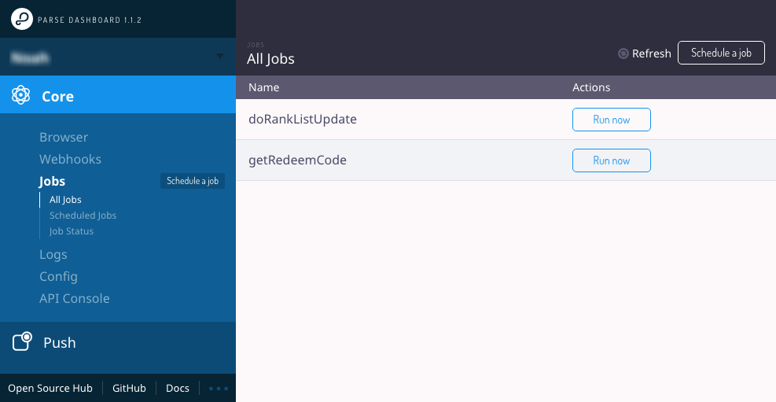
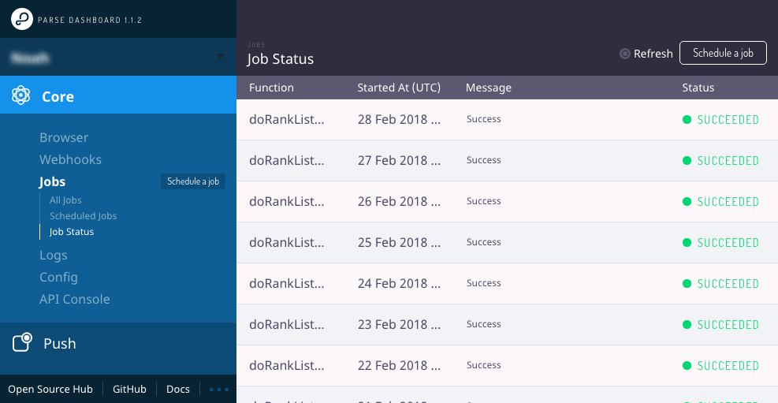

# Job 服務

> Job 服務，主要提供伺服端**「依照排程進行動作」**的能力，通常也比一般的 API 函式需要更多的執行時間。在 Game Services 中，通常用來做定時的伺服器資料更新，比如：每日排行榜更新...等等

目前在 Parse 以及 Firebase 服務中，都沒有直接支援 Job 的 Runner，因此需要特別的設計來做。在 Parse 中，可以定義 Job Function，可在 Dashboard 中手動進行命令執行，也會把每次執行的時間與紀錄保存下來，如需要自動化執行，則需要而外設計，將會在範例中介紹透過伺服器 Cron 來實作 Scheduler。在 Firebase 中，則需透過 App Engine Cron 透過 Cloud Pub/Sub 來觸發 Cloud Function，來實作 Job Runner

## 目錄

* [Parse Cloud Job 定義](./#parse-job)
* [Parse Cloud Job 檢視、執行](./#parse-job-dashboard)
* [主題：在 Parse 上透過 Cron 配置常用的 Scheduler](zai-parse-shang-tou-guo-cron-pei-zhi-chang-yong-de-scheduler.md)

## Parse Cloud Job 定義 {#parse-job}

Cloud Job 實作在 Parse Cloud Code 中，以 Parse.Cloud.job 來定義內容

```text
Parse.Cloud.job("myJob", function(request, status) {
  // 取得 Params
  const params = request.params;
  // 取得 Headers
  const headers = request.headers;

  // 更新 Job Message
  status.message("I just started");

  doSomethingVeryLong().then(function(result) {
    // 更新 Job Status 為成功，並更新 Job Message
    status.success("I just finished");
  })
  .catch(function(error) {
    // 更新 Job Status 為失敗，並更新 Job Message
    status.error("There was an error");
  });
});
```

## Parse Cloud Job 檢視、執行 {#parse-job-dashboard}

* Cloud Job 僅能透過 REST API 來呼叫執行，並且必須使用 Master Key

```text
curl -X POST 
  -H 'X-Parse-Application-Id: appId' 
  -H 'X-Parse-Master-Key: masterKey' 
  https://my-parse-server.com/parse/jobs/myJob
```

* 如果您的 Dashboard 有設定 Master Key，您也可以透過 Dashboard 介面來進行檢視、執行，還能看見 Job 的執行狀態與紀錄





