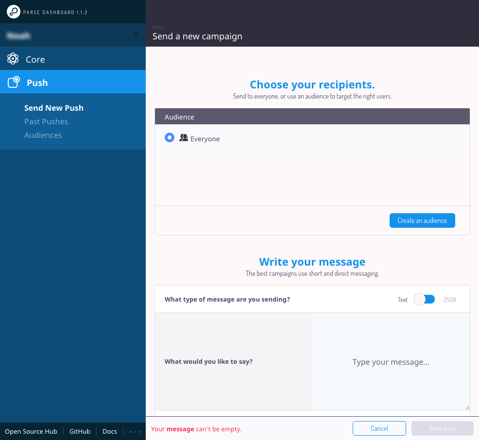
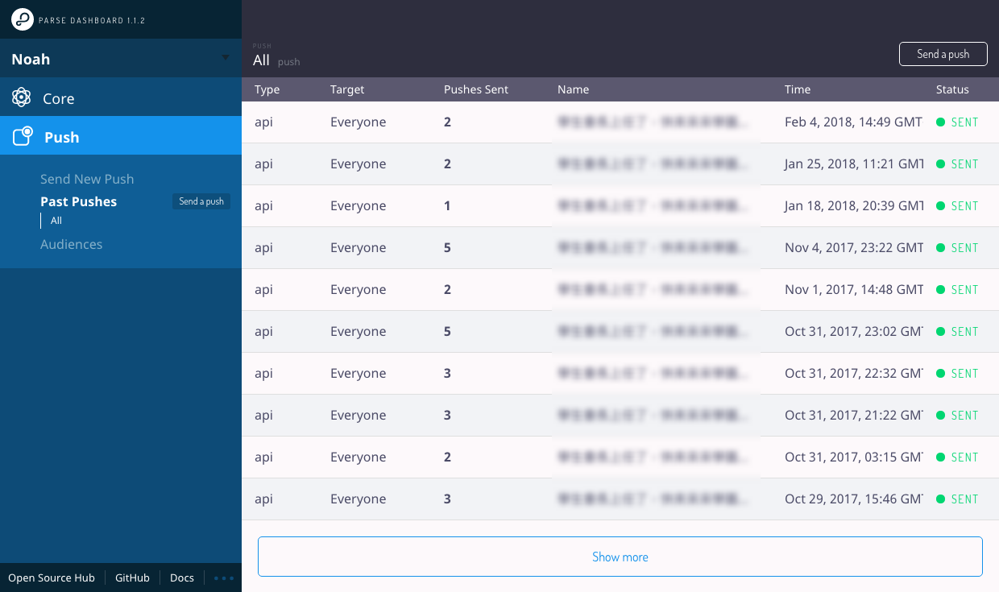

# Parse 推送服務設定與測試

## Parse Server Push Adapter 設定

若要透過 Parse 來推送兩個平台的通知，需分別取得推送所需要的資訊（前面有介紹），Android 須取得 **Sender ID** 以及**伺服器金鑰**，iOS 須取得 **development.p12** 以及 **production.p12** 兩個檔案，並上傳至伺服器中

```text
var server = new ParseServer({
  // ...
  push: {
    android: {
      senderId: '',  // 取得的 FCM Sender ID 
      apiKey: ''     // 取得的 FCM 伺服器金鑰
    },
    ios: [
      {
        pfx: '/path/to/production.p12',  // 正式環境 p12 憑證檔案位置
        passphrase: '',                  // 憑證密碼（沒有的話可免去此欄位）
        bundleId: '',                    // Bundle ID
        production: true                 // 正式環境設定
      },
      {
        pfx: '/path/to/development.p12', // 開發環境 p12 憑證檔案位置 
        passphrase: '',                  // 憑證密碼（沒有的話可免去此欄位）
        bundleId: '',                    // Bundle ID
        production: false                // 開發環境設定
      }
    ]  
  }
});
```

另外 iOS 也支援 token-based authentication 推送

```text
ios: {
  token: {
    key: '/path/to/AuthKey_XXXXX.p8',    // p8 憑證檔案位置
    keyId: '',                           // Key Id
    teamId: ''                           // Team ID
  },
  topic: 'com.domain.appname',           // Bundle Identifier
  production: false                      // 正式或開發環境設定
}
```

## 將 token 存放至 Installation

您必須將 Android 以及 iOS 取得的 token，儲存至 Parse 伺服器上的 Installation 資料表，之後才能透過平台來推送

* 透過 Android SDK

```text
// Application Class
public void onCreate() {
  // ...
  ParseInstallation.getCurrentInstallation().saveInBackground();
}
```

* 透過 iOS SDK

```text
(void)application:(UIApplication *)application
  didRegisterForRemoteNotificationsWithDeviceToken:(NSData *)deviceToken {
  // ...
  PFInstallation *currentInstallation = [PFInstallation currentInstallation];
  [currentInstallation setDeviceTokenFromData:deviceToken];
  [currentInstallation saveInBackground];
}
```

* 透過 Rest 手動新增 Installation

|  | Android | iOS |
| :--- | :--- | :--- |
| GCMSenderId | Sender ID | X |
| deviceToken | token | token |
| appIdentifier | Bundle ID | Bundle ID |
| deviceType | android | ios |
| pushType | gcm | X |

## 使用 Dashboard 進行推送

在 Parse Dashboard 中可進行手動的 Push Notification，並看到部分的推送數據





