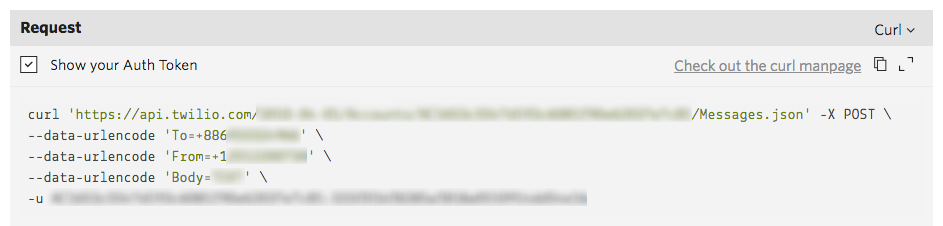

# SMS 服務

> SMS 也是在小產品中是常見的 Account System 的驗證方式，這樣的驗證方法在大多數地區，比 Email 更具有**「實名性質」**，在 Firebase Authentication 中提供了這樣的驗證方式

在 Parse 服務平台中，Account System 並沒有直接設計 SMS 認證環節，但由於 User 資料表也具有可擴充性，所以可以透過自行設計來達成

在 Firebase 平台中，雖然 Authentication 由官方提供了 SMS 驗證服務，但驗證服務為收費項目，此外如果想寄送客製化內容的簡訊，還是必須透過外部的服務商提供

## 目錄

* [常見 SMS 服務商](sms-fu-wu.md#service-provider)
* [申請 Twilio 服務](sms-fu-wu.md#twilio)
* [在 Parse Cloud Code 中使用 Twilio 服務寄送 SMS](sms-fu-wu.md#cloudcode)

## 常見 SMS 服務商 <a id="service-provider"></a>

> 注意：製表日期 2018 Mar，服務商可能隨時調整服務內容

常見的 SMS 服務商中，只有 Amazon SNS 提供了 100 則的免費額度。以下提供常見服務價格計算機，以及價格比較表（美金），僅供參考

* [Amazon SNS 價格計算機](https://aws.amazon.com/tw/sns/sms-pricing/)
* [Twilio 價格介紹](https://www.twilio.com/sms/pricing/tw)
* [Plivo 價格介紹](https://www.plivo.com/pricing/TW/#!sms)
* [Nexmo 價格介紹](https://www.nexmo.com/products/sms/pricing)

| 服務 | 電信 | 收費 |
| :--- | :--- | :--- |
| Amazon SNS（非廣告簡訊） | 台灣大哥大 | $0.04612 |
| Amazon SNS（非廣告簡訊） | 台灣之星、威寶 | $0.0438 |
| Amazon SNS（非廣告簡訊） | 其他 | $0.06997 |
| Twilio | - | $0.0540 |
| Plivo | 亞太電信 | $0.0380 |
| Plivo | 中華電信 | $0.0360 |
| Plivo | 台灣之星、威寶 | $0.0300 |
| Plivo | 其他 | $0.0350 |
| Nexmo | - | $0.0533 |

> 如果服務限於台灣，可參考在地服務商，如：[三竹簡訊](https://sms.mitake.com.tw/common/header/price.jsp)，可能在地的價格會更實惠

## 申請 Twilio 服務 <a id="twilio"></a>

* 前往 Twilio 網站申請帳號

> [https://www.twilio.com/try-twilio](https://www.twilio.com/try-twilio)


* 前往 Twilio Programmable SMS，取得一個 Twilio phone number

> [https://www.twilio.com/console/sms/getting-started/build](https://www.twilio.com/console/sms/getting-started/build)


* 完成取得號碼後，便可透過 Console 看到寄送 SMS 的範例。但是未升級成正式帳號之前，會有寄送的限制
  * 只能寄送到[通過驗證的號碼](https://www.twilio.com/console/phone-numbers/verified)，並且僅能寄送至[特定範圍的國家](https://www.twilio.com/console/sms/settings/geo-permissions)
  * 訊息會被標記上 Sent from a Twilio Trial Account"
  * 只能申請一個 Twilio number



* 如要使用在正式環境，需充值升級成正式版帳號

> [https://www.twilio.com/console/billing/upgrade](https://www.twilio.com/console/billing/upgrade)

* 可在 General Setting 中查詢自己的 **ACCOUNT SID** 以及 **AUTH TOKEN** 作為 API 呼叫使用

> [https://www.twilio.com/console/project/settings](https://www.twilio.com/console/project/settings)


## 在 Parse Cloud Code 中使用 Twilio 服務寄送 SMS <a id="cloudcode"></a>

在 Parse Cloud Code 中，以 httpRequest 呼叫 Twilio REST API 即可。更詳細的 Twilio API 可[參考此文件](https://www.twilio.com/docs/api/messaging/message)

```text
Parse.Cloud.httpRequest({
    method: 'POST',
    url: 'https://${ACCOUNT SID}:${AUTH TOKEN}@api.twilio.com/2010-04-01/Accounts/${ACCOUNT SID}/Messages.json',
    body: {
        Body:"",        // 簡訊內容
        From:"",        // 簡訊寄件者，您的 Twilio Phone Number，比如：+12512200730
        To:""           // 簡訊寄送對像，比如：+886912345678
    }
})
```

